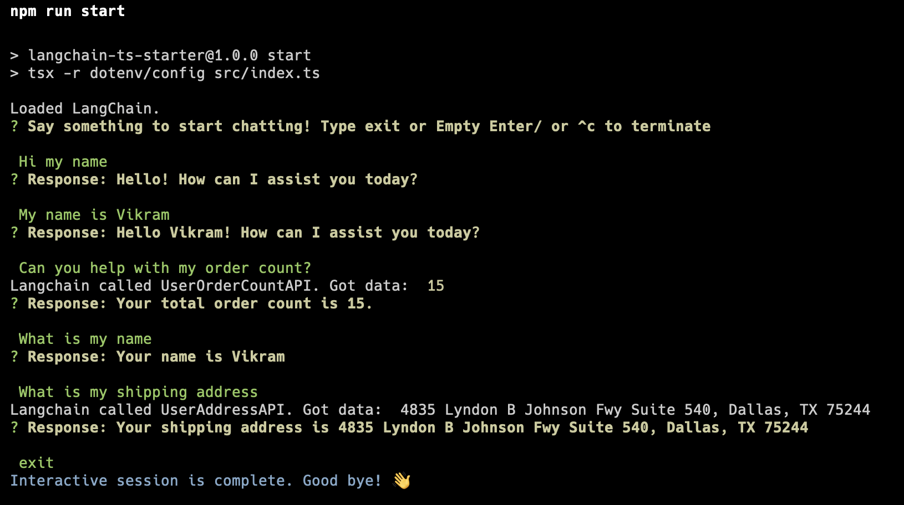

# Chat with LLM that uses Plugins

Type from your terminal that interacts with OpenAI chat
When asked about "orders" and "shipping address", uses langchain tools to make API calls and send data back to OpenAI

Bootstrapped using [Langchain Typescript SDK](https://github.com/hwchase17/langchainjs).

This uses the same tsconfig and build setup as the [examples repo](https://github.com/hwchase17/langchainjs/tree/main/examples), to ensure it's in sync with the official docs.

# What's included

- Typescript
- .env file configuration
- ESLint and Prettier for formatting
- Turborepo to quickly run build scripts
- `tsx` to quickly run compiled code

# How to use

- Clone this repository
- `npm install`
- Rename .env.example to .env
- Needs OpenAI API key in .env in the key `OPENAI_API_KEY`
- `npm run db` uses json-server to serve the JSON data within src/db/* on `http://localhost:3000/`
- `npm start` to run your program
- `Ask about 'how many order I have'` to initiate an API call to `/orderCount`
- `Ask about 'what is my shipping address'` to initiate an API call to `/addressDetails`

# Usage Screenshot

